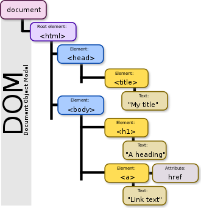
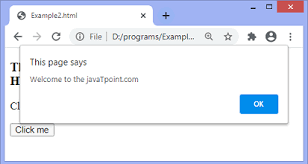
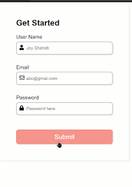
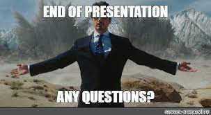

# Homework-DOM
## _DOM_

### According to the Document Object
### Model (DOM), every HTML tag is an
### object. Nested tags are “children” of
### the enclosing one. The text inside a
### tag is an object as well.

## _Document.getElementById(id)_
.png)

### If an element has the id  attribute, we can get the  element using the method document.getElementById(id), no matter where it is.
----------------------------------------------------------------------------
## _Events_

### JavaScript's interaction with HTML is
### handled through events that occur
### when the user or the browser
### manipulates a page.

### When the page loads, it is called an
### event. When the user clicks a button,
### that click too is an event. Other
### examples include events like
### pressing any key, closing a window,
### resizing a window, etc.
##  _Onclick()_

### The onclick event occurs when the user clicks on an HTML element.

# Forms, controls

### The change event triggers when the element has finished changing.

### For text inputs that means that the event occurs when it loses focus.

